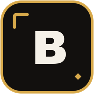

<p align="center">
  
</p>

<h1 align="center"><code>budget</code></h1>

<p align="center"><strong>Private personal finance without the spreadsheet.</strong></p>

<p align="center">
  Track income, expenses, savings, categories, and recurring activity.<br>
  A Clerk-authenticated dashboard backed by your own Postgres database.
</p>

<p align="center">
  <a href="https://budget.uptonm.dev">Website</a> ·
  <a href="#features">Features</a> ·
  <a href="./prisma/schema.prisma">Data model</a> ·
  <a href="./.env.example">Environment</a>
</p>

## Features

| Area | What is included |
| --- | --- |
| Dashboard | Current-month income, expenses, savings, and cash left over with month-over-month comparisons |
| Trends | Twelve months of cash flow and expense totals grouped by category |
| Activity | Recent transactions and upcoming recurring items in a fourteen-day window |
| Transactions | Separate income, expense, and savings workflows with create, edit, sort, and delete actions |
| Recurrence | Daily, weekly, biweekly, monthly, every-two-months, quarterly, and yearly schedules |
| Categories | Seeded system defaults plus user-owned categories for each transaction type |
| Profile | Clerk identity with an optional UploadThing-backed profile image |

Every finance route requires a Clerk session. The project is designed as a
single-owner personal app; do not treat the current implementation as a
hardened multi-tenant finance service.

## Run locally

```bash
cp .env.example .env
# Fill in DB_URL and the Clerk values before continuing.
bun install
bun run db:push
bun run dev
```

Use a direct, non-pooled Neon connection string in local development. The
deployed app uses a pooled connection string.

Configuration is documented in [`.env.example`](./.env.example):

| Variable | When needed | Purpose |
| --- | --- | --- |
| `DB_URL` | Required | PostgreSQL connection used by Prisma |
| `NEXT_PUBLIC_CLERK_PUBLISHABLE_KEY` | Required | Browser-side Clerk configuration |
| `CLERK_SECRET_KEY` | Required | Server-side Clerk authentication |
| `NEXT_PUBLIC_CLERK_SIGN_IN_URL` / `NEXT_PUBLIC_CLERK_SIGN_UP_URL` | Optional | Custom authentication routes |
| `UPLOADTHING_TOKEN` | Optional | Profile-image uploads |
| `GATES_ORG_ID` | Production | Organization that stores the fleet gate flags |
| `GATES_APP_ID=budget` | Production | This deployment's gate key |

Production middleware reads the fleet gate configuration even when the gate is
unlocked, so both `GATES_*` values are required in production.

## Development

| Command | Purpose |
| --- | --- |
| `bun run dev` | Start the Next.js development server |
| `bun run build` | Create a production build |
| `bun run typecheck` | Run TypeScript without emitting files |
| `bun run check` | Check formatting and lint rules with Biome |
| `bun run db:push` | Apply the Prisma schema without a migration |
| `bun run db:studio` | Inspect the database with Prisma Studio |

## Architecture

| Path | Purpose |
| --- | --- |
| [`src/app/(app)`](./src/app/%28app%29) | Authenticated dashboard, transaction, category, and profile routes |
| [`src/server/api`](./src/server/api) | Dashboard, transaction, category, and user tRPC routers |
| [`src/components`](./src/components) | Dashboard charts, tables, and forms |
| [`prisma/schema.prisma`](./prisma/schema.prisma) | PostgreSQL user, category, and transaction model |
| [`prisma/seed`](./prisma/seed) | Legacy system-category and sample-data seed scripts |

Budget is server-backed rather than local-only: finance data is stored in
PostgreSQL, identity is handled by Clerk, and profile images use UploadThing
when configured. Vercel Analytics and Speed Insights are enabled. The deployed
site opts out of search indexing, but that metadata is not an access-control
boundary.
